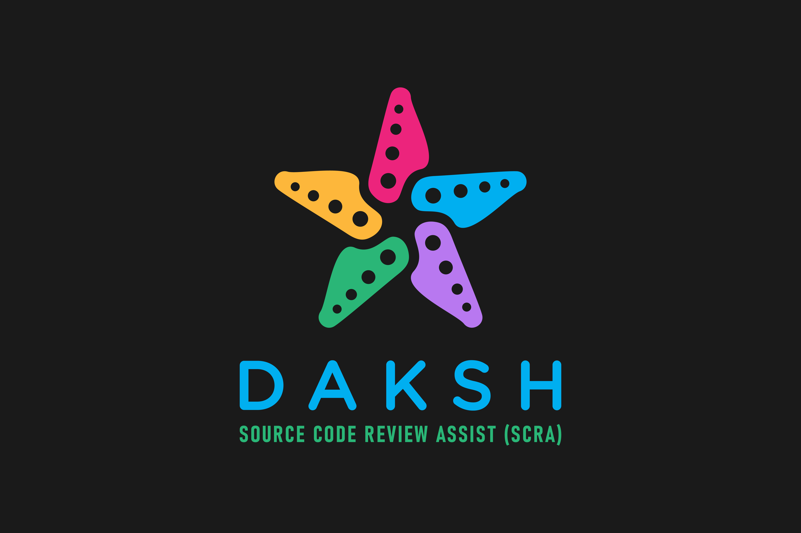

<p align="center">
  
</p>

# Daksh SCRA (Source Code Review Assist) - Beta v0.2

```
Author: 	
	Debasis Mohanty (d3basis.m0hanty@gmail.com)
	Twitter: @coffeensecurity
	www.coffeeandsecurity.com
```


> Note: The tool is still in its infancy and is still being worked on. I initially introduced this tool during the Source Code Review training at Blackhat USA 2022 (6-9) to assist the students with automating a few code review-related tasks. This tool’s purpose is to assist code reviewers in automating some tasks for findings areas of interest during the source code review for security vulnerabilities. 

The tool currently offers the following functionalities: 
* Options to use programming language-specific rules specific for finding areas of interests
* Option to extend or add new rules for any new or existing languages
* Generate a raw output both in text and HTML format for inspection

Feel free to contribute towards updating or adding new rules and future development.

If you find any bugs, report them to d3basis.m0hanty@gmail.com.


# HOWTO

## Pre-requisites
Python3 and all the libraries listed in requirements.txt

## Setting up environment to run this tool

#### 1. Setup a virtual environment
	$ pip install virtualenv

	$ virtualenv -p python3 {name-of-virtual-env}  		// Create a virtualenv
	Example: virtualenv -p python3 venv

	$ source {name-of-virtual-env}/bin/activate 		// To activate virtual environment you just created
	Example: source venv/bin/activate

After running the activate command you should see the name of your virtual env at the beginning of your terminal like this:
	(venv) $ 

#### 2. Ensure all required libraries are installed within the virtual environment
You must run the below command after activating the virtual environment as mentioned in the previous steps.

	pip install -r requirements.txt

Once the above step successfully installs all the required libraries, refer to the following tool usage commands to run the tool.

## Tool Usage

$ python3 dakshscra.py -h		// To view avaialble options and arguments

	usage: dakshscra.py [-h] [-r RULE_FILE] [-f FILE_TYPES] [-v] [-t TARGET_DIR] [-l {R,RF}] [-recon]

	options:
	-h, --help            	Show this help message and exit
	-r RULE_FILE          	Specify platform specific rule name
	-f FILE_TYPES         	Specify file types to scan
	-v                    	specify verbosity level {'-v', '-vv'}
	-t TARGET_DIR         	Specify target directory path
	-l {R,RF}, --list {R,RF}
							List rules [R] OR rules and filetypes [RF]
	-recon                	Platform and technology reconnaissance

	Supported RULE_FILE: 	alljs, angular, common, dotnet, java, php, python, rubyrails, sql_sp
	Supported FILE_TYPES:	alljs, angular, customlist, dotnet, php, python, java, rubyrails, silverstrip, allfiles

```
Example Commands: 
	dakshscra.py -r dotnet -f dotnet -t <path_to_source_dir>	# Scan dotnet specific files and apply dotnet rules
	dakshscra.py -r common -f allfiles -t <path_to_source_dir>	# Scan all file types and apply some common checks
Note: 
	The rules and the language supported can found found in the rules directory. Refer to the XML files.  
	The supported file types are mentioned in the file 'lib/userdef/misclib.py'
```

Reports: The tool generates both HTML and TEXT-based reports. The HTML report is still a work in progress and not well formatted. However, the TEXT-based output is easy to read. 

	TEXT Based Report: 	/DakshSCRA/output/areas_of_interest.txt (Areas of Interest (Patterns Identified))
	Files Scanned Logs:	/DakshSCRA/output/filepaths.txt 	(Source Files Path)
	HTML Report Path: 	/DakshSCRA/report/report.html 		(Work In Progress - Ignore this report)